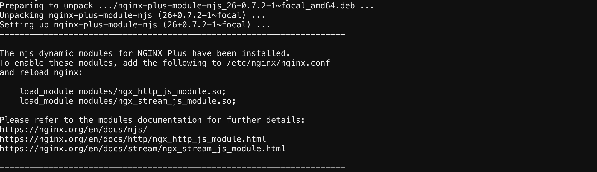
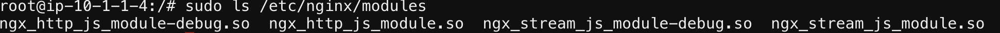
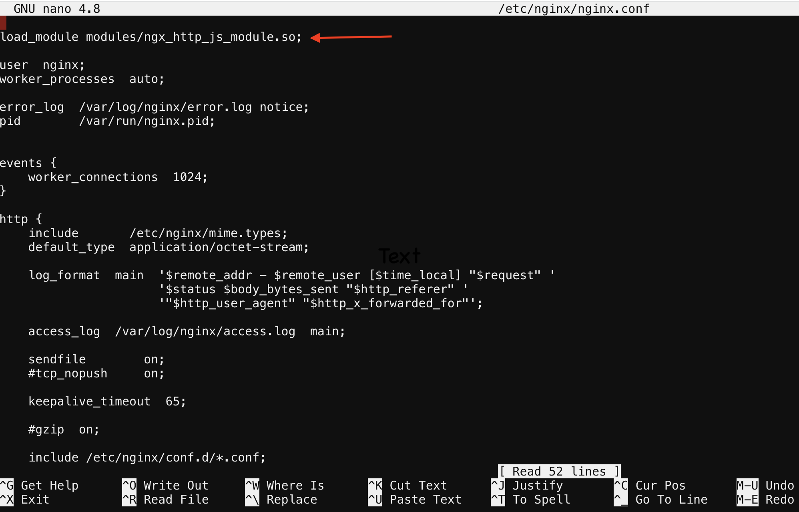
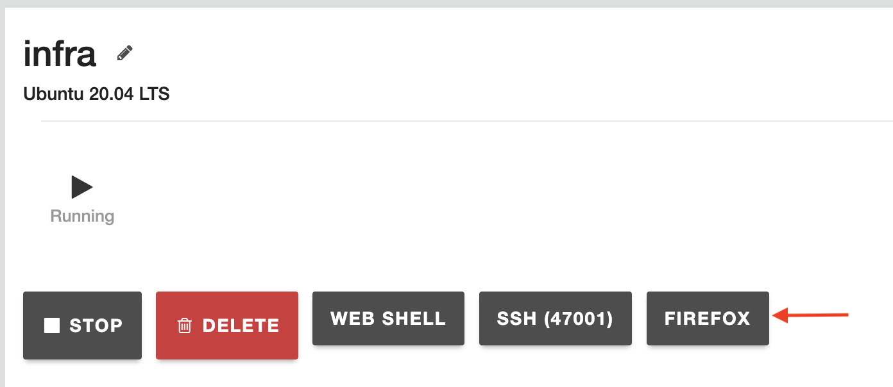
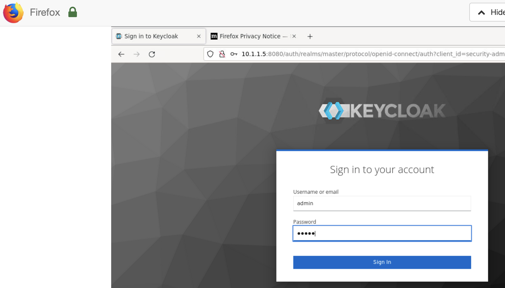
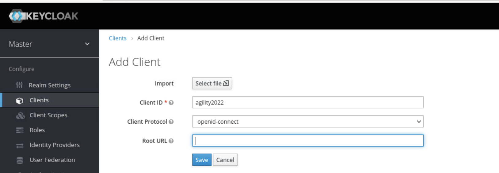
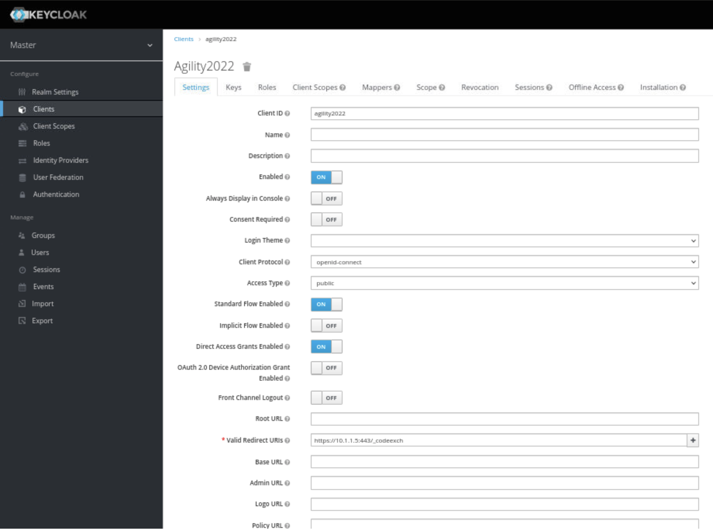

Class 1: Access on NGINX+ - Authentication for Web Access
=====================================================

Lab Setup
---------
.. list-table::
   :header-rows: 1

   * - **Hostname**
     - **IP-ADDR**
     - **Credentials**
   * - nginx
     - 10.1.1.4
     - ubuntu/ubuntu
   * - infra
     - 10.1.1.5
     - admin/admin
       root/default
   * - container/keycloak
     - 10.1.1.5:8080
     - admin/admin

This lab will show how to enable single sign-on (SSO) for applications being proxied by NGINX Plus. The solution uses OpenID Connect as the authentication mechanism, with Keycloak as the identity provider (IdP), and NGINX Plus as the relying party.

High Level View of components in OpenID Connect Environment
=====================================================
.. image:: images/ualab01.svg
  :width: 800
  
This implementation assumes the following environment:

The identity provider (IdP) supports OpenID Connect 1.0
The authorization code flow is in use
NGINX Plus is configured as a relying party
The IdP knows NGINX Plus as a confidential client or a public client using PKCE
With this environment, both the client and NGINX Plus communicate directly with the IdP at different stages during the initial authentication event.

.. image:: images/ualab02.svg
  :width: 800
  
Installing Prerequisites:
==================================

1) Start by installing the NGINX JavaScript module (njs) whixh is required for handling the interaction between NGINX Plus and the OpenID Connect provider (IdP). Install the njs module after installing NGINX Plus by running one of the following:

**run the following on nginx box**

$ sudo apt install nginx-plus-module-njs 

  
verify modules are loaded into nginx

**run the following command**

$ sudo ls /etc/ssl/modules

  
2) Now you will need load the module in the nginx.conf 

The following directive included in the top-level (“main”) configuration context in /etc/nginx/nginx.conf, to load the NGINX JavaScript module:

**run below command then copy the following command and place into nginx.conf file**

nano /etc/nginx/nginx.conf

load_module modules/ngx_http_js_module.so;

**save and exit file**

Config the IdP Keycloak
   
   1. Connect to container via udf connection methods

   2. Login to keycloak

Configuring Keycloak
====================
  1) Create a Keycloak client for NGINX Plus in the Keycloak GUI:

      In the left navigation column, click Clients. On the Clients page that opens, click the Create button in the upper right corner.

      On the Add Client page that opens, enter or select these values, then click the  Save  button.

      **Client ID – agility2022**

      **Client Protocol – openid-connect.**

   
  2) On the NGINX Plus page that opens, enter or select these values on the Settings tab:

      Access Type – confidential
      Valid Redirect URIs – The URI of the NGINX Plus instance, including the port number, and ending in /_codexch (in this guide it is https://10.1.1.5:443/_codexch)
      
      *Notes: For production, we strongly recommend that you use SSL/TLS (port 443).*
      *The port number is mandatory even when you’re using the default port for HTTP (80) or HTTPS (443).*

