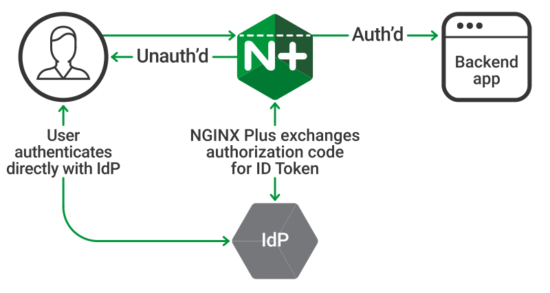
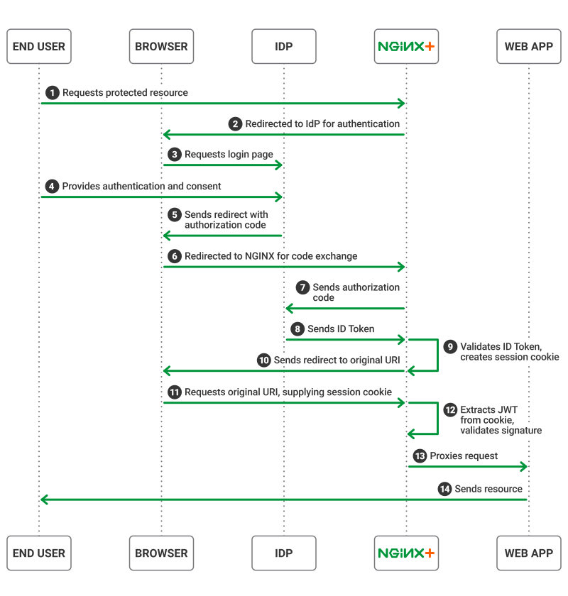

Class 1: Access on NGINX+ - Authentication for Web Access
=====================================================

Lab Setup
---------
.. list-table::
   :header-rows: 1

   * - **Hostname**
     - **IP-ADDR**
     - **Credentials**
   * - nginx
     - 10.1.1.4
     - ubuntu/ubuntu
   * - infra
     - 10.1.1.5
     - admin/admin
       root/default
   * - container/keycloak
     - 10.1.1.5:8080
     - admin/admin

This lab will show how to enable single sign-on (SSO) for applications being proxied by NGINX Plus. The solution uses OpenID Connect as the authentication mechanism, with Keycloak as the identity provider (IdP), and NGINX Plus as the relying party.

High Level View of components in OpenID Connect Environment
=====================================================

  
This implementation assumes the following environment:

The identity provider (IdP) supports OpenID Connect 1.0
The authorization code flow is in use
NGINX Plus is configured as a relying party
The IdP knows NGINX Plus as a confidential client or a public client using PKCE
With this environment, both the client and NGINX Plus communicate directly with the IdP at different stages during the initial authentication event.

  
Installing Prerequisites:
==================================

1) Start by installing the NGINX JavaScript module (njs) whixh is required for handling the interaction between NGINX Plus and the OpenID Connect provider (IdP). Install the njs module after installing NGINX Plus by running one of the following:

.. code-block:: text
:caption: run the below code on nginx server to install njs module

  sudo apt install nginx-plus-module-njs

